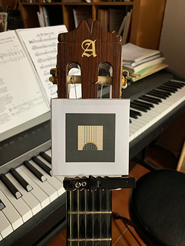
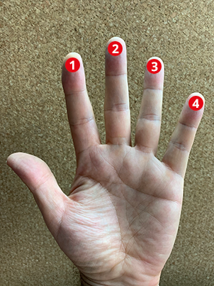

# AR-3D-chords

Aplicación en realidad aumentada para aprender los acordes de la guitarra. Prototipo funcional que forma parte de mi TFG de grado multimedia.
Demo: https://alfonsogchico.github.io/AR-3D-chords/

El objetivo de la aplicación es que el usuario aprenda a interpretar/leer los diagramas de acordes.
Actualmente sólo incluye los acordes mayores del sistema CAGED. 

## Instrucciones de uso
1. **Imprimir** [la hoja con la marca](https://alfonsogchico.github.io/AR-3D-chords/resources/marca-recortable-AGC.pdf), recortar por la linea, plegar por la mitad y fijar con celo las dos mitades.
2. **Colocar** la marca sobre la cejuela, en la parte final del mástil. Centrar y hacer coincidir la parte inferior con el final del mástil:
3. **Coger la guitarra** con el mástil hacia la izquierda y situarse frente a la webcam. Procurar que la marca aparezca en pantalla.
4. **Seleccionar** con las flechas o los cursores **el acorde a aprender** y pisar las cuerdas en el lugar indicado por las marcas rojas. 

Nota: El diagrama muestra qué dedo pisa en cada lugar. La numeración de los dedos de la mano izquierda es la siguiente: 

